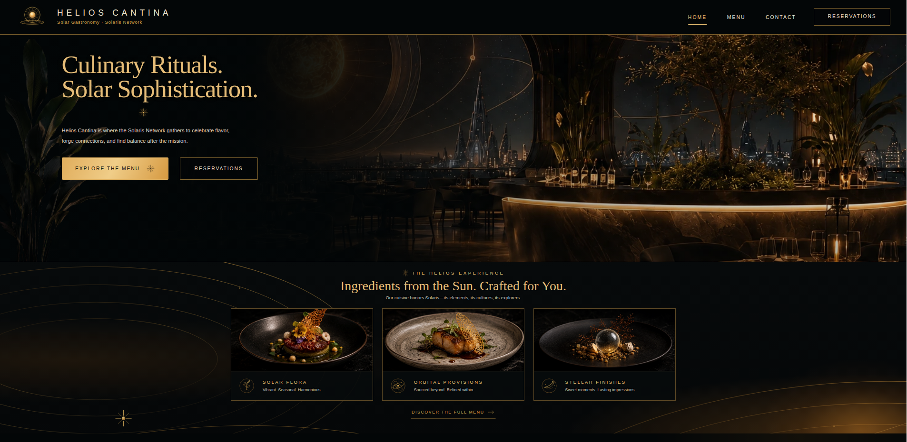

# Restaurant Page - Helios Cantina

> **Luxury solar gastronomy in the Solaris Universe.** A cinematic, responsive restaurant experience built with vanilla JavaScript and Webpack for [The Odin Project's Restaurant Page](https://www.theodinproject.com/lessons/node-path-javascript-restaurant-page).


Helios Cantina is a fictional fine-dining restaurant and social lounge aboard the **Solaris Network**. The project reimagines The Odin Project's Restaurant Page assignment as a polished hospitality website, combining solar futurism, editorial fine-dining aesthetics, atmospheric photography, and modular DOM rendering.

The application is intentionally framework-free: the page shell is provided by HTML, styling lives in CSS, and the Home, Menu, and Contact views are created and switched entirely with JavaScript.

**Live Demo:** [Launch Helios Cantina](https://progritit.github.io/restaurant_page/)



---

## Key Features

- **JavaScript-rendered pages** — Home, Menu, and Contact content is created dynamically through dedicated ES modules.
- **Tabbed navigation** — navigation buttons switch views without loading separate HTML pages.
- **Luxury Solaris design system** — obsidian surfaces, champagne gold accents, orbital geometry, warm solar lighting, and restrained futuristic detailing.
- **Responsive layouts** — CSS Grid, Flexbox, `clamp()`, and media queries adapt the experience across desktop and smaller screens.
- **High-fidelity local imagery** — optimized WebP restaurant and culinary photography supports the cinematic visual direction.
- **Custom SVG asset system** — reusable solar, navigation, contact, social, and culinary iconography keeps the interface visually consistent.
- **Privacy-friendly typography** — Cormorant Garamond and Montserrat are self-hosted as WOFF2 files, avoiding runtime requests to third-party font CDNs.
- **Accessible UI foundations** — semantic controls, form labels, alternative text, ARIA labels, and visible keyboard focus states are included throughout the interface.
- **Reservation interface** — a styled front-end reservation form with guest, date, time, and special-request controls.
- **Developer footer** — dynamic year and links to the developer's GitHub and LinkedIn profiles.

> **Note:** Reservation, newsletter, and contact controls are presentation-only. No back-end service or form submission endpoint is connected.

---

## Tech Stack

| Area | Technology |
| --- | --- |
| Markup | HTML5 |
| Styling | CSS3, Grid, Flexbox, custom properties, media queries |
| Application logic | Vanilla JavaScript, ES modules, DOM API |
| Bundling | Webpack |
| Development server | webpack-dev-server |
| Asset handling | Webpack asset modules, WebP, SVG, WOFF2 |
| Fonts | Cormorant Garamond, Montserrat — locally hosted |
| Version control | Git, GitHub |
| Deployment target | GitHub Pages |

No front-end framework or runtime UI library is used.

---

## Project Structure

```text
helios-cantina/
├── assets/
│   ├── decorations/
│   ├── fonts/
│   ├── icons/
│   └── images/
│       ├── contact/
│       ├── home/
│       └── menu/
├── src/
│   ├── contact.js
│   ├── home.js
│   ├── index.js
│   ├── menu.js
│   ├── styles.css
│   └── template.html
├── .gitignore
├── package.json
├── webpack.config.js
└── README.md
```

### Application Architecture

The project follows the modular structure required by The Odin Project:

- `template.html` provides the persistent page shell, navigation, and `#content` mounting point.
- `index.js` is the Webpack entry point and coordinates initial rendering and tab switching.
- `home.js` creates the landing experience and featured culinary cards.
- `menu.js` renders menu categories, dishes, pricing, signature selections, and culinary imagery.
- `contact.js` builds the restaurant information, reservation UI, hours, social area, and Helios footer.
- `styles.css` contains the shared design system, page-specific layouts, responsive behavior, and local font declarations.

Each page module creates DOM elements and appends them to the shared content container. Navigation clears the current view and invokes the appropriate page-rendering function.

---

## Getting Started

### Prerequisites

Install the following before running the project locally:

- [Node.js](https://nodejs.org/) — a current LTS release is recommended.
- npm — included with Node.js.
- Git — required only if cloning the repository.

### Installation

Clone the repository and enter the project directory:

```bash
git clone https://github.com/progritit/REPOSITORY-NAME.git
cd REPOSITORY-NAME
```

Install the dependencies declared in `package.json`:

```bash
npm install
```

Start the Webpack development server:

```bash
npx webpack serve
```

Then open:

```text
http://localhost:8080
```

### Environment Variables

No environment variables or secrets are required. The project runs entirely in the browser using local static assets.

---

## Usage

Once the development server is running, use the header navigation to switch between the three application views:

- **Home** — introduces Helios Cantina and its signature culinary experience.
- **Menu** — presents starters, mains, desserts, and drinks with pricing and signature dishes.
- **Contact** — displays the fictional Solaris location, opening hours, contact information, reservation UI, and social links.

Because the project uses JavaScript-rendered tabs, these views share a single HTML document rather than separate page files.

### Production Build

Create a bundled build in `dist/` with:

```bash
npx webpack
```

The generated `dist/` directory is intentionally excluded from normal source control through `.gitignore` and can be reproduced from the source files and npm dependencies.

---

## Running Tests

An automated test suite is not currently configured for this project.

Before deployment, perform a production build as a basic compilation check:

```bash
npx webpack
```

Recommended manual checks include:

- switching between Home, Menu, and Contact repeatedly;
- checking active navigation states;
- confirming local images, SVG icons, and fonts load correctly;
- testing the reservation form controls and keyboard focus states;
- checking responsive layouts at desktop, tablet, and mobile widths;
- confirming external developer links open as expected.

---

## Deployment

The project is designed for deployment to **GitHub Pages** from the generated `dist/` directory.

For the first deployment, create the deployment branch once:

```bash
git branch gh-pages
```

For each deployment or redeployment:

```bash
git checkout gh-pages
git merge main --no-edit
npx webpack
git add dist -f
git commit -m "Deployment commit"
git subtree push --prefix dist origin gh-pages
git checkout main
```

In the repository's GitHub Pages settings, configure `gh-pages` as the source branch.

---

## Contributing

Contributions and learning-focused improvements are welcome.

1. Fork the repository.
2. Create a focused feature or fix branch:

   ```bash
   git checkout -b feat/short-description
   ```

3. Make and verify your changes locally.
4. Commit with a clear, descriptive message.
5. Push the branch to your fork.
6. Open a pull request describing what changed and why.

Please keep contributions aligned with the project's framework-free JavaScript architecture and established Solaris visual language.

---

## License

The project source code is licensed under the **MIT License**. See the [`LICENSE`](./LICENSE) file for the full license text.

Third-party font files are distributed under their respective **SIL Open Font License 1.1** terms and are not relicensed under MIT. Their license texts are preserved alongside the locally hosted font files in `assets/fonts/`.

---

## Credits

### Design & Development

Designed and developed by **Clebson Web Dev** as part of [The Odin Project](https://www.theodinproject.com/) JavaScript curriculum.

- [GitHub](https://github.com/progritit)
- [LinkedIn](https://www.linkedin.com/in/clebsoncosta/)

**Helios Cantina** is a fictional restaurant within the broader **Solaris Universe**, a connected visual world developed across Clebson's web-development portfolio projects.

### Visual Assets

The project's custom restaurant imagery, visual concepts, and supporting asset generation were created with assistance from **OpenAI ChatGPT**, then selected, refined, and integrated into the final interface for the Helios Cantina visual direction.

### Typography

The project uses the following open-source typefaces, downloaded for local hosting so the website does not require runtime requests to an external font CDN:

- **[Cormorant Garamond](https://fonts.google.com/specimen/Cormorant+Garamond)** — used under the SIL Open Font License 1.1. The corresponding license text is preserved in `assets/fonts/OFL-Cormorant-Garamond.txt`.
- **[Montserrat](https://fonts.google.com/specimen/Montserrat)** — used under the SIL Open Font License 1.1. The corresponding license text is preserved in `assets/fonts/OFL-Montserrat.txt`.

Font files were obtained from **Google Fonts** and are served locally by the project.
